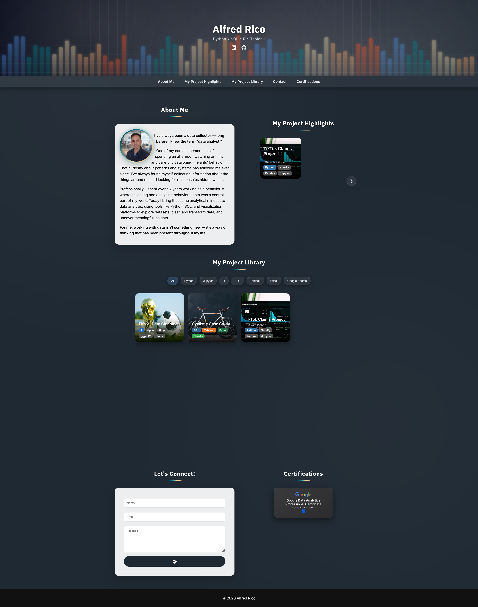

# Alfred Rico — Data Analyst Portfolio

🔗 **Live Portfolio:** https://shadyeggs.github.io/

---

## Preview

---

## Overview

This repository contains the source code for my personal data analyst portfolio website.
It showcases end-to-end projects focused on exploratory data analysis, statistical reasoning, and data-driven insights.

The goal of this portfolio is to demonstrate not just technical ability, but the ability to communicate findings clearly and structure analytical work in a meaningful way.

---

## Featured Project

### TikTok Claims Classification (EDA with Python)

🔗 https://shadyeggs.github.io/EDA-with-Python/

* Conducted exploratory data analysis on ~19,000 TikTok videos
* Identified engagement patterns differentiating claim vs opinion content
* Engineered engagement rate features (likes, comments, shares per view)
* Highlighted the impact of outliers and skewed distributions on analysis
* Established a foundation for downstream predictive modeling

---

## Skills Demonstrated

* Exploratory Data Analysis (EDA)
* Data Cleaning & Transformation
* Statistical Analysis
* Feature Engineering
* Data Interpretation & Insight Communication

---

## Tech Stack

* **Python** (Pandas, NumPy)
* **Jupyter Notebook**
* **HTML / CSS / JavaScript**
* **GitHub Pages**

---

## Repository Structure

* `index.html` → Main portfolio homepage
* `EDA-with-Python/` → Project-specific webpage and analysis
* Additional projects will be added as the portfolio expands

---

## Purpose

This portfolio is designed to present analytical work in a structured, accessible format that mirrors real-world data workflows — from raw data inspection to insight generation.

---

## Contact

* GitHub: https://github.com/ShadyEggs

---

© 2026 Alfred Rico
